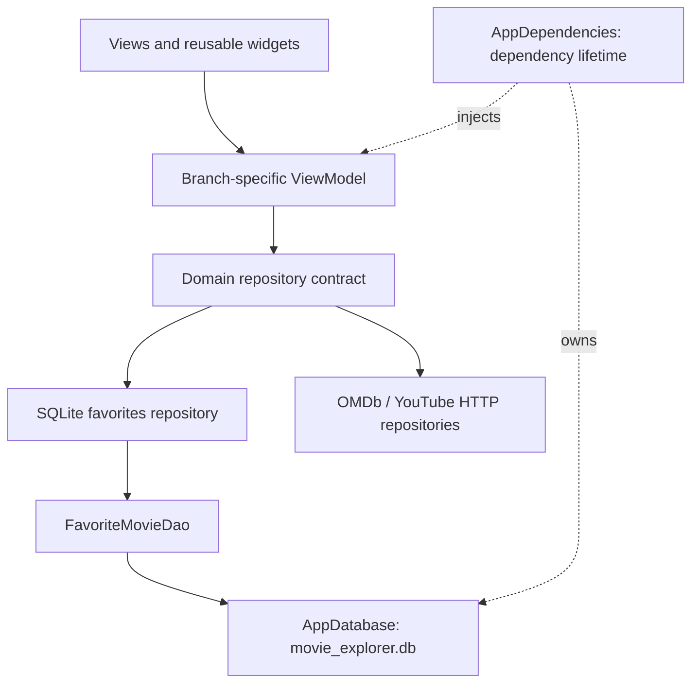

# SQLite and MVVM — Provider

This branch teaches MVVM with `provider` and `ChangeNotifier`.

| Feature | ViewModel | View binding |
| --- | --- | --- |
| Catalog | `presentation/view_models/movie_catalog_view_model.dart` → `MovieCatalogViewModel` | `Consumer` and `Selector` |
| Favorites | `presentation/view_models/favorites_view_model.dart` → `FavoritesViewModel` | `Selector` observes favorite + busy status |
| Trailer | `presentation/view_models/trailer_view_model.dart` → `TrailerViewModel` | A screen-scoped `ChangeNotifierProvider` and `Consumer` |

`app.dart` owns `AppDependencies` for the lifetime of the app. `MultiProvider` supplies repository interfaces and creates the catalog/favorites ViewModels; provider disposes ChangeNotifiers. Widgets use `read` for commands and `watch`/`Consumer`/`Selector` for rendered state. The tutorial's former `*Controller` classes are now named `*ViewModel` to make their architectural role explicit.

## Responsibilities



- **View:** layout, navigation, text controllers, and the video player lifecycle. It renders state and invokes commands; it does not run SQL or make HTTP requests.
- **ViewModel:** loading/error state, sorting/filtering, favorite commands, optimistic updates, and stale-result/lifecycle protection. The state-management library determines how views observe it.
- **Domain:** movie models and repository interfaces. It imports neither Flutter nor SQLite. OMDb JSON conversion belongs to the data mapper.
- **Repository:** fulfills a domain contract. The SQLite implementation turns database failures into a readable retry message; remote implementations encapsulate OMDb and YouTube requests.
- **DAO (data access object):** parameterized favorite queries, row mapping, and transactional writes.
- **Database owner:** lazily opens one connection, applies versioned migrations, and closes at the end of the app scope. Concurrent first requests share the same opening future.
- **Composition root:** `lib/di/app_dependencies.dart` creates stable dependencies and owns the HTTP client/database. Tests inject fake repositories or a real SQLite FFI factory. Injected database/client objects transfer ownership to this scope; repository overrides remain caller-owned. Replace the app scope/key when changing dependencies at runtime.

There is no wrapper ViewModel around another state manager and no one-line use-case class for every repository method. Add a domain use-case when a real rule needs coordination or reuse.

## Shared project layout

```text
lib/
  core/database/app_database.dart
  domain/
    models/movie.dart
    repositories/{favorites,movie,trailer}_repository.dart
  data/
    local/favorite_movie_dao.dart
    local/sample_movies.dart
    mappers/omdb_movie_mapper.dart
    repositories/sqlite_favorites_repository.dart
    repositories/{movie,trailer}_repository.dart
  di/app_dependencies.dart
  presentation/
    models/trailer_state.dart
    view_models/                 # branch-specific implementations
    views/                       # catalog, favorites, details, trailer
    widgets/favorite_button.dart # selected favorite/busy state + error feedback
    widgets/favorites_body.dart  # loading, error/retry, empty, and list states
```

## SQLite: follow one favorite

1. The heart button invokes the ViewModel's `toggle(movie)` command.
2. The ViewModel marks that movie busy and updates the visible state optimistically.
3. The repository delegates to `FavoriteMovieDao.upsert` or `delete`.
4. The DAO obtains `AppDatabase.connection`. The owner opens the existing `movie_explorer.db` in the platform database directory when first needed.
5. A save transaction updates an existing row, or inserts a new one if none exists. Updating metadata preserves the original `saved_at`. IDs are bound parameters, including quotes or SQL-looking text.
6. Success clears the busy flag. Failure restores the previous favorite state and displays a message. The favorites screen also shows hydration errors with Retry instead of pretending the database is empty.

While the initial saved snapshot is loading, heart buttons are disabled. Repeated taps on a pending movie are ignored, and a refresh cannot overwrite an in-flight optimistic update. Other movies can still be updated independently. Disposed ViewModels ignore late completions.

### Schema and migration

The original version 1 `favorite_movies` table is retained. Version 2 adds `favorite_movies_title_idx` for the case-insensitive title + ID ordering. `onUpgrade` runs transactionally; it does not drop tables or clear favorites. The version 1 fixture in `test/fixtures/favorites_v1.sql` represents the original schema and protects compatibility.

Useful read-only inspection queries:

```sql
PRAGMA user_version;
SELECT imdb_id, title, saved_at FROM favorite_movies
ORDER BY title COLLATE NOCASE, imdb_id;
SELECT name, sql FROM sqlite_master WHERE type = 'index';
```

Favorites, including their movie metadata, are local to the installed app. SQLite here does **not** provide cloud sync, encrypted storage, poster downloads, or a cache of every search result. API searches and video playback still need a connection. Keep the same app installation/identifier when comparing branch persistence; uninstalling or clearing app data removes this database.

## Practice in order

1. Run the branch without API keys, save a bundled demo movie, fully stop the app, and reopen Favorites. The movie should still be there.
2. Trace the heart button → ViewModel → domain interface → repository → DAO → database. Set a breakpoint in each layer.
3. Run `test/data/sqlite_favorites_test.dart`. Read the close/reopen, version 1 migration, quoted-ID, failed-write, and open-retry cases.
4. Run `test/favorites_resilience_test.dart`. Follow how a fake delayed write prevents duplicate taps, and how failure rolls back the optimistic state.
5. As an exercise, add a personal note to a favorite using a **new version 3 migration**. Add a migration test before changing the DAO; do not edit the old migration to simulate an upgrade.
6. Repeat the same feature on the other two branches. Keep the database and contracts identical and compare only presentation state and dependency wiring.

## Checks

This repository retains its Flutter 3.29.2 / Dart 3.7.2 baseline. `sqflite` stays at 2.4.2; the added `sqflite_common_ffi` 2.3.4+4 is a test dependency compatible with that baseline.

```sh
flutter pub get
flutter analyze
flutter test
```

The tests use temporary real SQLite files through FFI for persistence and migrations, and injected fakes for ViewModel/widget behavior. No live API credentials are needed. The intentionally corrupt-file test can print a SQLite diagnostic before recovering; a passing test confirms retry behavior. GitHub Actions runs formatting, analysis, and the tests for each learning branch.

Native `sqflite` targets Android/iOS/macOS; this repository's provided mobile runners are Android and iOS. The FFI test dependency does not silently add Windows/Linux/Web runtime support. Device plugin integration, App Store signing, live OMDb/YouTube requests, image loading, and playback require their own device checks.

## References

- [Flutter architecture guide](https://docs.flutter.dev/app-architecture/guide)
- [Flutter SQLite cookbook](https://docs.flutter.dev/cookbook/persistence/sqlite)
- [sqflite 2.4.2](https://pub.dev/packages/sqflite/versions/2.4.2)
- [sqflite FFI testing](https://pub.dev/packages/sqflite_common_ffi/versions/2.3.4%2B4)
