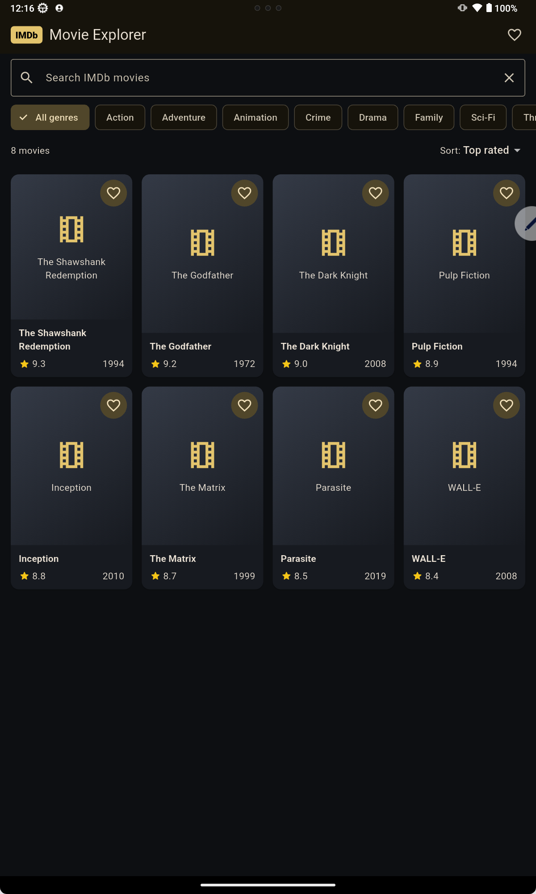
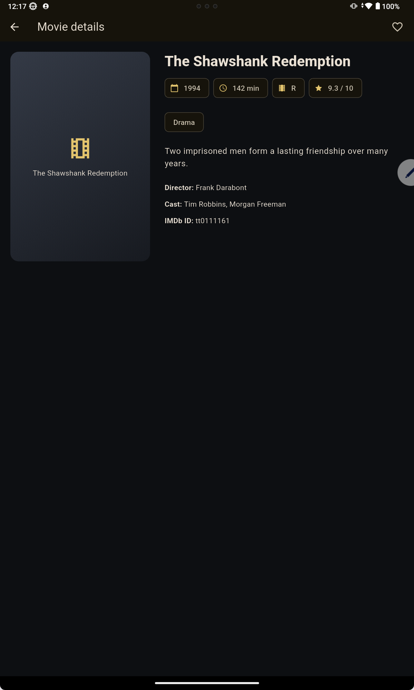

# Flutter State Management Specialist — Provider

This branch implements the complete movie app with `provider` and
`ChangeNotifier`.

## Features

- Movie list and debounced search
- Genre filter
- Sort by IMDb rating or release year
- Favorite/unfavorite from the list or details screen
- Movie details
- Favorites screen
- Loading, refresh, empty, and error states
- Stale-request protection for rapid searches
- Bundled offline demo catalog

## Screenshots

| Movie catalog | Movie details |
| --- | --- |
|  |  |

## Run it

```sh
flutter pub get
flutter run
```

The bundled catalog is used when no API key is supplied. This checkout already
has an ignored local `omdb.json`. To make your own local config, copy and edit
the safe template:

```sh
cp omdb.example.json omdb.json
flutter run --dart-define-from-file=omdb.json
```

The API key is inserted centrally by `OmdbMovieRepository._buildUri`, so every
OMDb search and detail request includes the `apikey` query parameter.

OMDb is an independent service and is not affiliated with IMDb. Its search
response does not contain genres or ratings, so this learning app hydrates the
first ten results with detail calls, then filters and sorts that page locally.
For a production app, add caching, pagination, request throttling, and a backend
that protects the key.

## Learn the architecture

Read [PROVIDER_SPECIALIST_GUIDE.md](PROVIDER_SPECIALIST_GUIDE.md), then explore:

- `lib/app.dart` — dependency creation and provider scope
- `lib/state/movie_catalog_controller.dart` — async and derived state
- `lib/state/favorites_controller.dart` — small independent state
- `lib/screens/home_screen.dart` — `read`, `Consumer`, and `Selector`
- `lib/data/movie_repository.dart` — API boundary and testable abstraction

Run the checks with:

```sh
flutter analyze
flutter test
```
